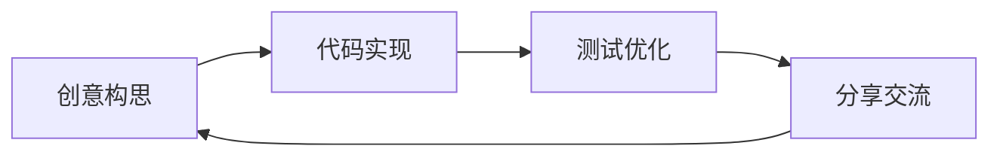

# 🚀 探索者日记

欢迎来到我的数字小窝！我是 **[黄泽明]**，一个永远在路上的学习者和创造者。

## 🌈 我的世界

## 🎨 技能图谱

| 领域 | 熟练度 | 热爱程度 |
|------|--------|----------|
| 前端开发 | ⭐⭐⭐⭐☆ | ❤❤❤❤🤍 |
| 后端架构 | ⭐⭐⭐☆☆ | ❤❤❤🤍🤍 |
| 产品设计 | ⭐⭐⭐⭐☆ | ❤❤❤❤❤ |

## 📚 最近在学

- 🔭 探索量子计算基础
- 🎨 学习数字绘画技巧
- 🌱 尝试种植多肉植物

✨ *"不是看到希望才坚持，而是坚持才看到希望"*
